<div align="center">

# IoT & Embedded Systems Engineering Coursework
### RMUTI Computer Engineering • Microcontroller & IoT Portfolio

<p align="center">
  
  
  
  
  
  
</p>

<p align="center">
  คลังรวบรวมโครงงานวิศวกรรมระบบสมองกลฝังตัว (Embedded Systems), งานปฏิบัติการไมโครคอนโทรลเลอร์<br />
  และระบบอินเทอร์เน็ตของสรรพสิ่ง (Internet of Things - IoT)<br />
  สาขาวิชาวิศวกรรมคอมพิวเตอร์ คณะวิศวกรรมศาสตร์และเทคโนโลยี มหาวิทยาลัยเทคโนโลยีราชมงคลอีสาน
</p>

</div>

---

## สารบัญโครงสร้างคลัง (Table of Contents)

- [1. โครงงานหลัก (Featured Engineering Projects)](#1-โครงงานหลัก-featured-engineering-projects)
  - [Project 1: เครื่องควบคุมอุปกรณ์ไฟฟ้าตามอุณหภูมิแบบตั้งเวลา](#project-1-เครื่องควบคุมอุปกรณ์ไฟฟ้าตามอุณหภูมิแบบตั้งเวลา-temperature--timer-based-controller)
  - [Project 2: ระบบควบคุมและมอนิเตอร์มอเตอร์ผ่าน IoT Web App & Firebase](#project-2-ระบบควบคุมและมอนิเตอร์มอเตอร์ผ่าน-iot-web-app--firebase)
- [2. สรุปงานปฏิบัติการประจำสัปดาห์ (Lab Modules Index)](#2-สรุปงานปฏิบัติการประจำสัปดาห์-lab-modules-index)
- [3. แผนผังโครงสร้างโฟลเดอร์ (Directory Structure)](#3-แผนผังโครงสร้างโฟลเดอร์-directory-structure)
- [4. ข้อมูลผู้จัดทำ (Author)](#4-ข้อมูลผู้จัดทำ-author)

---

## 1. โครงงานหลัก (Featured Engineering Projects)

### Project 1: เครื่องควบคุมอุปกรณ์ไฟฟ้าตามอุณหภูมิแบบตั้งเวลา (Temperature & Timer-Based Controller)

ระบบควบคุมโหลดไฟฟ้ากระแสสลับแบบอัตโนมัติ พัฒนาบนบอร์ด **ESP32 (MicroPython)** ทำงานร่วมกับเซนเซอร์วัดอุณหภูมิและความชื้นสัมพัทธ์ DHT22, โมดูลนาฬิกาเวลาจริง Real-Time Clock DS3231, จอแสดงผล I2C LCD 16x2, แป้นพิมพ์ 4x4 Keypad Matrix และระบบบันทึกสถานะการตั้งค่าลงหน่วยความจำถาวร (Flash Persistence) เพื่อป้องกันข้อมูลสูญหายเมื่อระบบรีเซ็ตหรือไฟดับ

#### แผนภาพวงจรและการเชื่อมต่ออุปกรณ์ (Hardware Schematic & Interfacing)

<div align="center">
  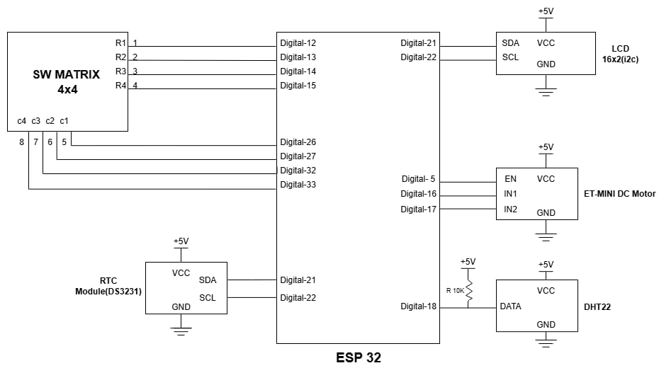
</div>

<br />

#### ตารางการเชื่อมต่อขาพิน ESP32 (Hardware Pinout Mapping)

<table width="100%">
  <thead>
    <tr>
      <th width="25%" align="center">อุปกรณ์ (Component)</th>
      <th width="20%" align="center">โปรโตคอล / รูปแบบ</th>
      <th width="25%" align="center">ขาพิน ESP32</th>
      <th width="30%" align="center">คำอธิบายการทำงาน</th>
    </tr>
  </thead>
  <tbody>
    <tr>
      <td><strong>DHT22 Sensor</strong></td>
      <td align="center">1-Wire Digital</td>
      <td align="center"><code>GPIO 4</code></td>
      <td>อ่านค่าอุณหภูมิ (°C) และความชื้นสัมพัทธ์ (%RH)</td>
    </tr>
    <tr>
      <td><strong>DS3231 RTC</strong></td>
      <td align="center">I2C Interface</td>
      <td align="center"><code>SCL: GPIO 22</code>, <code>SDA: GPIO 21</code></td>
      <td>นาฬิกาเวลาจริงความแม่นยำสูง นับเวลา วินาที/นาที/ชั่วโมง/วัน</td>
    </tr>
    <tr>
      <td><strong>I2C LCD 16x2</strong></td>
      <td align="center">I2C (0x27)</td>
      <td align="center"><code>SCL: GPIO 22</code>, <code>SDA: GPIO 21</code></td>
      <td>แสดงผลเวลา สถานะโหลด อุณหภูมิ และเมนูคำสั่ง</td>
    </tr>
    <tr>
      <td><strong>Relay Control Module</strong></td>
      <td align="center">Digital Output</td>
      <td align="center"><code>GPIO 25</code></td>
      <td>ควบคุมการตัด-ต่อวงจรอุปกรณ์ไฟฟ้า (Active HIGH)</td>
    </tr>
    <tr>
      <td><strong>4x4 Matrix Keypad</strong></td>
      <td align="center">Matrix Scan</td>
      <td align="center"><code>Row: 12, 13, 14, 15</code><br /><code>Col: 26, 27, 32, 33</code></td>
      <td>ป้อนคำสั่งลัด <code>*&lt;CMD&gt;#</code> เพื่อตั้งเวลาและเงื่อนไข</td>
    </tr>
    <tr>
      <td><strong>Non-Volatile Storage</strong></td>
      <td align="center">Flash File System</td>
      <td align="center"><code>data.txt (VFS)</code></td>
      <td>จดจำสถานะและค่าคอนฟิก ข้อมูลไม่หายเมื่อไฟดับ</td>
    </tr>
  </tbody>
</table>

<br />

#### ผังการทำงานของระบบ (System Architecture & Flowcharts)

<table width="100%">
  <thead>
    <tr>
      <th width="33.33%" align="center">ผังโปรแกรมหลัก (Main Flowchart)</th>
      <th width="33.33%" align="center">การประมวลผลคำสั่ง (Command Handler)</th>
      <th width="33.34%" align="center">การตรวจสอบเงื่อนไขเวลา (Timer Logic)</th>
    </tr>
  </thead>
  <tbody>
    <tr>
      <td width="33.33%" align="center" valign="top">
        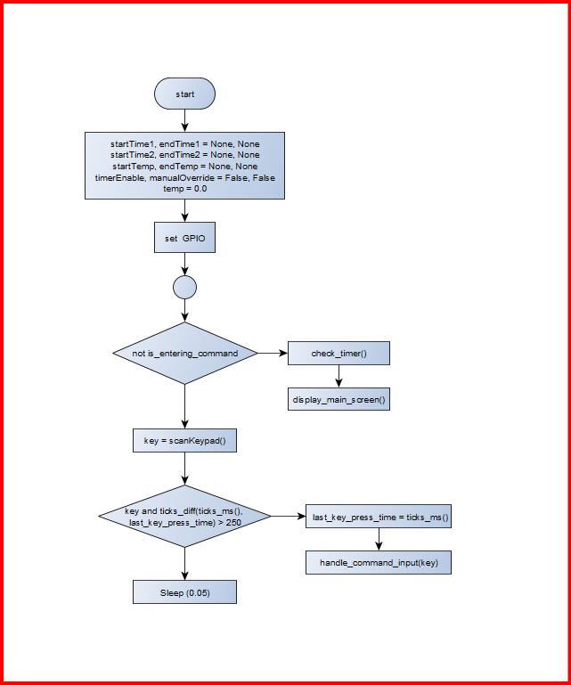
      </td>
      <td width="33.33%" align="center" valign="top">
        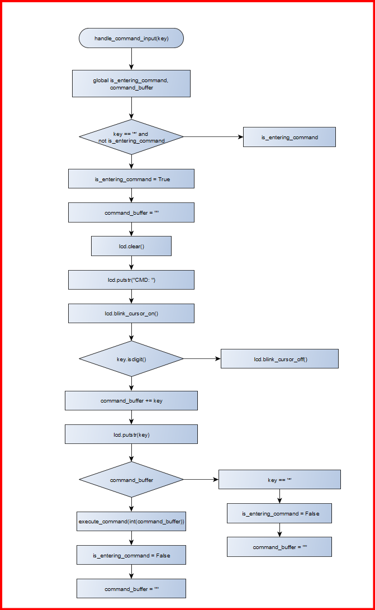
      </td>
      <td width="33.34%" align="center" valign="top">
        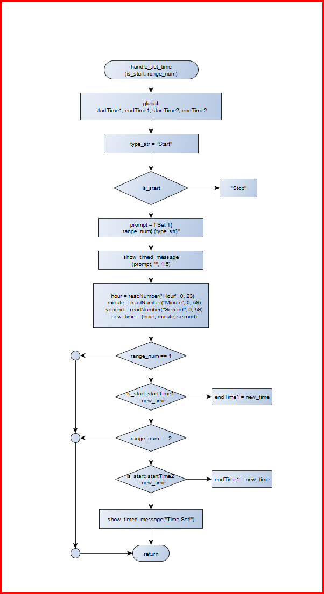
      </td>
    </tr>
  </tbody>
</table>

<br />

#### ผลการทดสอบการทำงาน 14 ฟังก์ชันคำสั่งจริง (Hardware Verification Matrix)

<table width="100%">
  <thead>
    <tr>
      <th width="10%" align="center">คำสั่ง</th>
      <th width="22%" align="center">ชื่อฟังก์ชัน</th>
      <th width="33%" align="center">คำอธิบายการทำงาน</th>
      <th width="35%" align="center">ภาพถ่ายผลการรันจริงบนจอ 16x2 LCD</th>
    </tr>
  </thead>
  <tbody>
    <tr>
      <td align="center"><code>*1#</code></td>
      <td><strong>Set System Time</strong></td>
      <td>ตั้งเวลาปัจจุบันให้กับโมดูล RTC DS3231 (ชั่วโมง/นาที/วินาที)</td>
      <td align="center">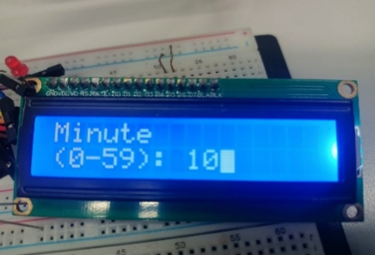</td>
    </tr>
    <tr>
      <td align="center"><code>*2#</code></td>
      <td><strong>Device OFF</strong></td>
      <td>สั่งตัดการทำงานของรีเลย์ทันที (Manual Override OFF)</td>
      <td align="center">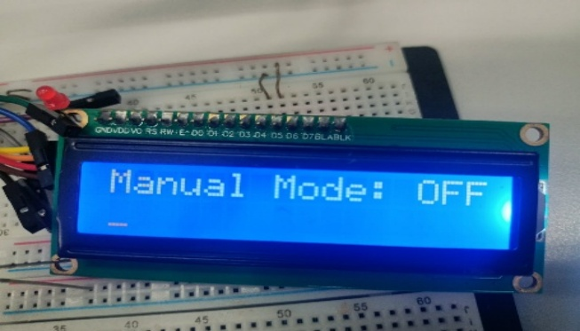</td>
    </tr>
    <tr>
      <td align="center"><code>*3#</code></td>
      <td><strong>Device ON</strong></td>
      <td>สั่งเปิดการทำงานของรีเลย์ทันที (Manual Override ON)</td>
      <td align="center">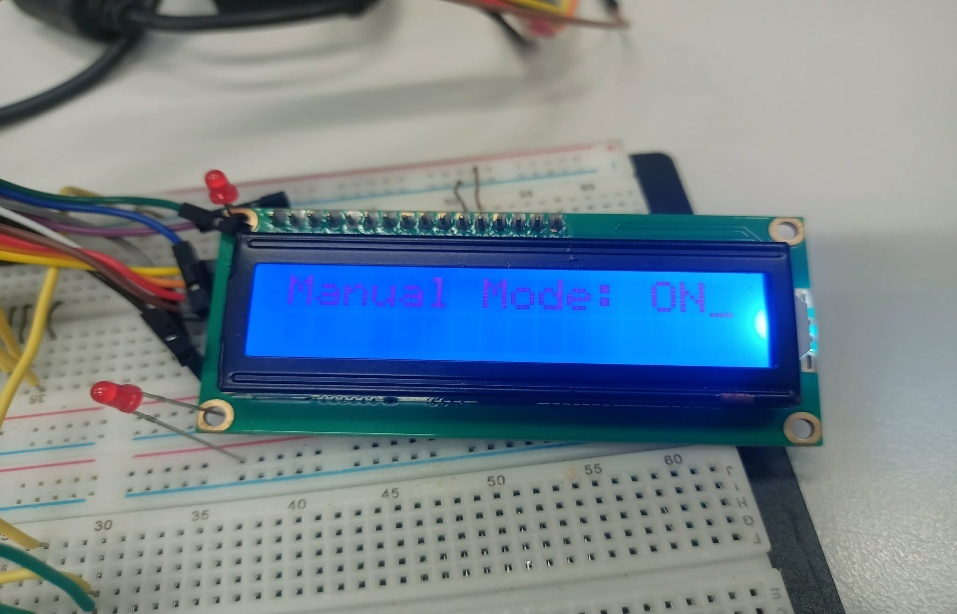</td>
    </tr>
    <tr>
      <td align="center"><code>*4#</code></td>
      <td><strong>Timer Mode OFF</strong></td>
      <td>ปิดโหมดควบคุมอัตโนมัติด้วยเวลาและอุณหภูมิ</td>
      <td align="center">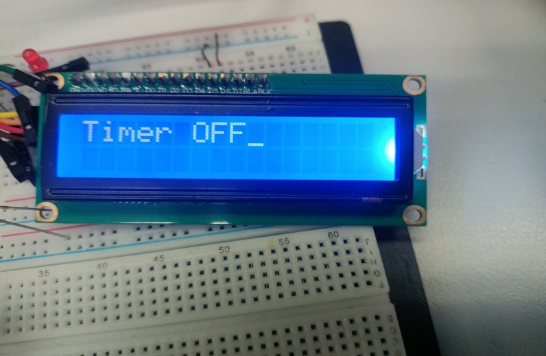</td>
    </tr>
    <tr>
      <td align="center"><code>*5#</code></td>
      <td><strong>Timer Mode ON</strong></td>
      <td>เปิดโหมดควบคุมอัตโนมัติตามช่วงเวลาและอุณหภูมิที่กำหนด</td>
      <td align="center">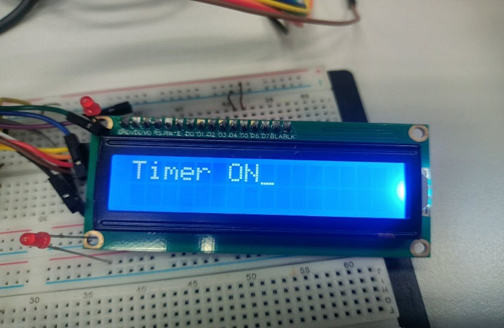</td>
    </tr>
    <tr>
      <td align="center"><code>*6#</code></td>
      <td><strong>Set Start Time 1</strong></td>
      <td>กำหนดเวลาเริ่มต้นเปิดโหลด ช่วงที่ 1 (T1 Start)</td>
      <td align="center">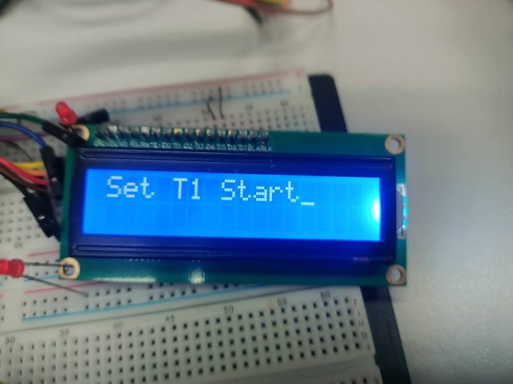</td>
    </tr>
    <tr>
      <td align="center"><code>*7#</code></td>
      <td><strong>Set Stop Time 1</strong></td>
      <td>กำหนดเวลาสิ้นสุดปิดโหลด ช่วงที่ 1 (T1 Stop)</td>
      <td align="center">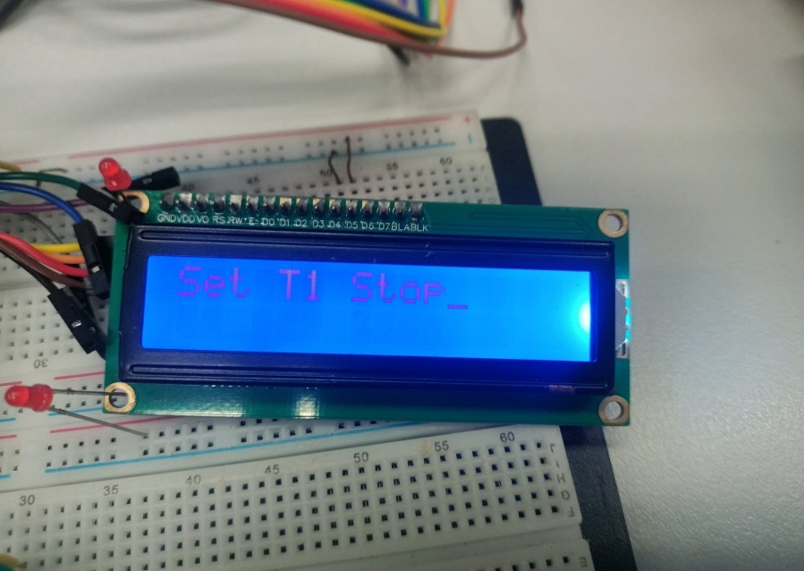</td>
    </tr>
    <tr>
      <td align="center"><code>*8#</code></td>
      <td><strong>Show Time Range 1</strong></td>
      <td>เรียกดูค่าช่วงเวลาเปิด-ปิดที่บันทึกไว้ของช่วงที่ 1</td>
      <td align="center">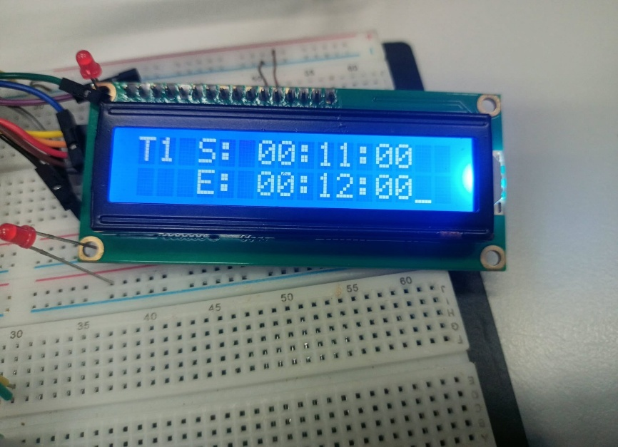</td>
    </tr>
    <tr>
      <td align="center"><code>*9#</code></td>
      <td><strong>Set Start Time 2</strong></td>
      <td>กำหนดเวลาเริ่มต้นเปิดโหลด ช่วงที่ 2 (T2 Start)</td>
      <td align="center">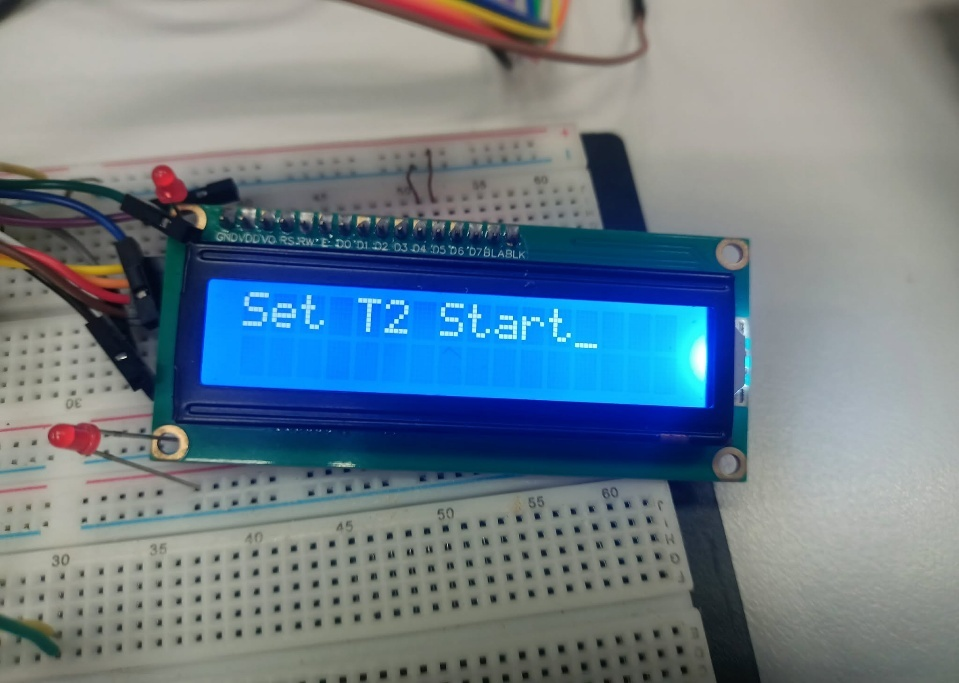</td>
    </tr>
    <tr>
      <td align="center"><code>*10#</code></td>
      <td><strong>Set Stop Time 2</strong></td>
      <td>กำหนดเวลาสิ้นสุดปิดโหลด ช่วงที่ 2 (T2 Stop)</td>
      <td align="center">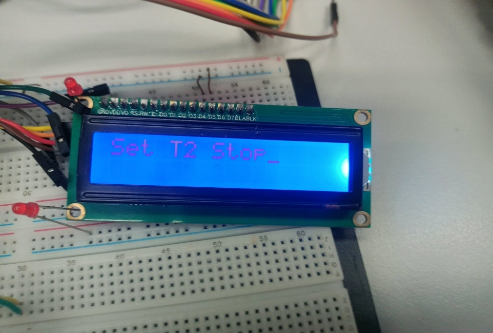</td>
    </tr>
    <tr>
      <td align="center"><code>*11#</code></td>
      <td><strong>Show Time Range 2</strong></td>
      <td>เรียกดูค่าช่วงเวลาเปิด-ปิดที่บันทึกไว้ของช่วงที่ 2</td>
      <td align="center">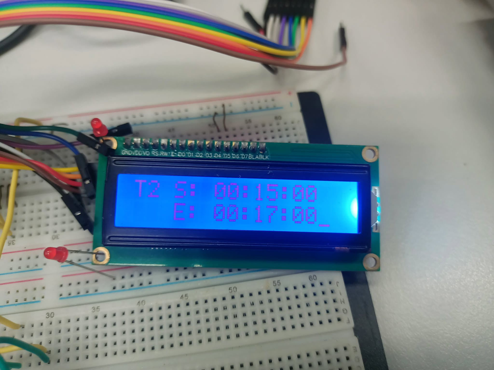</td>
    </tr>
    <tr>
      <td align="center"><code>*12#</code></td>
      <td><strong>Set Start Temp</strong></td>
      <td>กำหนดค่าอุณหภูมิขั้นต่ำ (°C) เพื่อเริ่มต้นสั่งงานโหลด</td>
      <td align="center">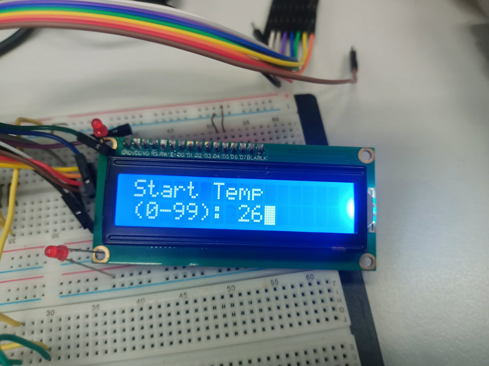</td>
    </tr>
    <tr>
      <td align="center"><code>*13#</code></td>
      <td><strong>Set Stop Temp</strong></td>
      <td>กำหนดค่าอุณหภูมิขอบเขตบน (°C) เพื่อสั่งตัดการทำงาน</td>
      <td align="center">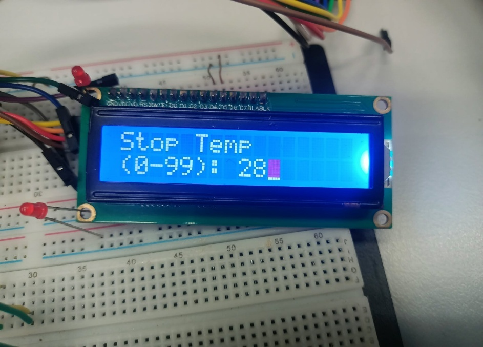</td>
    </tr>
    <tr>
      <td align="center"><code>*14#</code></td>
      <td><strong>Show Temp Range</strong></td>
      <td>เรียกดูค่าขอบเขตอุณหภูมิควบคุมที่ตั้งค่าไว้</td>
      <td align="center">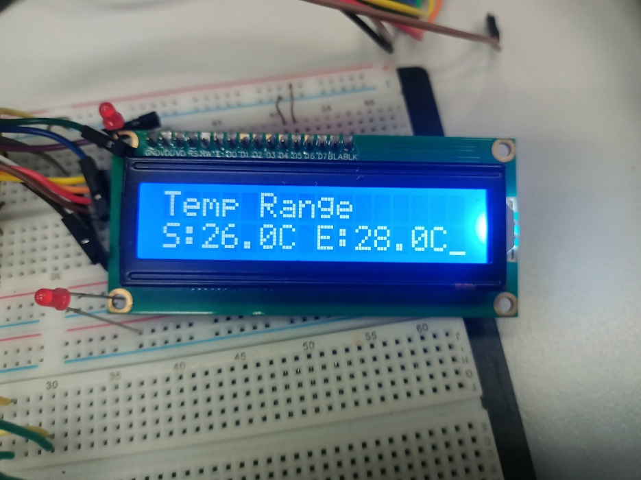</td>
    </tr>
  </tbody>
</table>

---

### Project 2: ระบบควบคุมและมอนิเตอร์มอเตอร์ผ่าน IoT Web App & Firebase

ระบบควบคุมและติดตามสถานะมอเตอร์ไฟฟ้ากระแสตรง (DC Motor) แบบเรียลไทม์ผ่านเครือข่ายอินเทอร์เน็ต ใช้ ESP32 เชื่อมต่อ Wi-Fi และส่งสถานะขึ้น **Firebase Realtime Database** สั่งงานผ่านเว็บแอปพลิเคชันแดชบอร์ดที่ออกแบบอย่างสวยงาม รองรับการปรับความเร็ว PWM, กลับทิศทางการหมุน (CW/CCW) และแสดงผลค่าโทรมาตร (Telemetry)

<div align="center">
  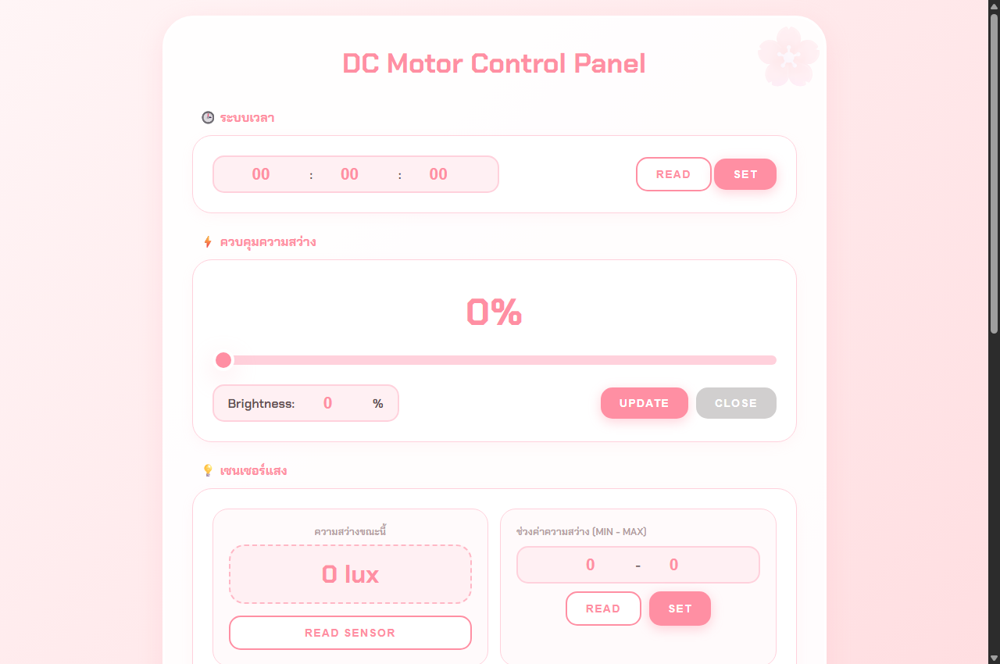
</div>

<br />

#### คุณลักษณะเด่นของระบบ (Core Features):
- **การสื่อสารสองทิศทางแบบเรียลไทม์ (Bidirectional IoT):** ส่งสถานะและรับคำสั่งผ่าน Firebase Realtime Database
- **การควบคุมความเร็วมอเตอร์:** ควบคุมสัญญาณพัลส์วิดธ์มอดูเลชัน (PWM) ปรับระดับความเร็วได้ละเอียด 0 - 100%
- **การเลือกทิศทางการหมุน:** ปรับสลับทิศทางการหมุน ตามเข็มนาฬิกา (Clockwise) และทวนเข็มนาฬิกา (Counter-Clockwise)
- **ระบบมอนิเตอร์สถานะการเชื่อมต่อ:** มีไฟสถานะระบุสถานะ Online/Offline ของบอร์ด ESP32 แบบเรียลไทม์

---

## 2. สรุปงานปฏิบัติการประจำสัปดาห์ (Lab Modules Index)

<table width="100%">
  <thead>
    <tr>
      <th width="18%" align="center">โมดูลแล็บ</th>
      <th width="32%" align="center">หัวข้อการทดลอง</th>
      <th width="50%" align="center">ทักษะและผลการเรียนรู้</th>
    </tr>
  </thead>
  <tbody>
    <tr>
      <td><code>lab05</code></td>
      <td><strong>Digital Input / Output</strong></td>
      <td>การควบคุมสวิตช์ปุ่มกด, แอลอีดี, วงจร Pull-up / Pull-down resistor บน ESP32</td>
    </tr>
    <tr>
      <td><code>lab06</code></td>
      <td><strong>Analog Input / Output</strong></td>
      <td>การอ่านค่าแรงดันอนาล็อกด้วย ADC 12-bit และการสร้างสัญญาณ PWM ปรับความสว่าง</td>
    </tr>
    <tr>
      <td><code>lab07</code></td>
      <td><strong>Keypad Matrix 4x4</strong></td>
      <td>อัลกอริทึมการสแกนแป้นพิมพ์เมทริกซ์ 16 ปุ่ม และการดีบาวน์สัญญาณ (Debouncing)</td>
    </tr>
    <tr>
      <td><code>lab08</code></td>
      <td><strong>I2C LCD & ADC Sensors</strong></td>
      <td>การขับหน้าจอแสดงผล Character LCD 16x2 ผ่านบัส I2C ร่วมกับการอ่านเซนเซอร์อนาล็อก</td>
    </tr>
    <tr>
      <td><code>lab09</code></td>
      <td><strong>Hardware Interrupts</strong></td>
      <td>การเขียนโปรแกรมบริการอินเตอร์รัพท์ (ISR) ดักจับสัญญาณขอบขาขึ้น-ขาลงโดยไม่บล็อกซีพียู</td>
    </tr>
    <tr>
      <td><code>lab10</code></td>
      <td><strong>RTC DS3231 Module</strong></td>
      <td>การเชื่อมต่อและการอ่าน-เขียนข้อมูลเวลาจริงผ่านโปรโตคอล I2C บนชิป DS3231</td>
    </tr>
    <tr>
      <td><code>lab11</code></td>
      <td><strong>Bluetooth Serial</strong></td>
      <td>การสื่อสารข้อมูลแบบไร้สายผ่าน Bluetooth Classic Serial กับสมาร์ตโฟน</td>
    </tr>
    <tr>
      <td><code>lab12</code></td>
      <td><strong>UART Serial Interface</strong></td>
      <td>การรับ-ส่งข้อมูลแบบอะซิงโครนัสผ่านพอร์ต Hardware UART ของไมโครคอนโทรลเลอร์</td>
    </tr>
    <tr>
      <td><code>lab13</code></td>
      <td><strong>Wi-Fi Networking</strong></td>
      <td>การกำหนดค่า ESP32 ในโหมด Station (STA) และ Access Point (AP)</td>
    </tr>
    <tr>
      <td><code>lab14</code></td>
      <td><strong>Socket Programming</strong></td>
      <td>การสร้างการเชื่อมต่อเน็ตเวิร์กระดับต่ำด้วย TCP/IP Socket ระหว่างไคลเอนต์และเซิร์ฟเวอร์</td>
    </tr>
    <tr>
      <td><code>lab15</code></td>
      <td><strong>Embedded Web Server</strong></td>
      <td>การสร้างไมโครเว็บเซิร์ฟเวอร์ภายใน ESP32 สำหรับให้ผู้ใช้เปิดเบราว์เซอร์ควบคุมอุปกรณ์</td>
    </tr>
    <tr>
      <td><code>lab16</code></td>
      <td><strong>Firebase Realtime Database</strong></td>
      <td>การเชื่อมต่อไมโครคอนโทรลเลอร์เข้ากับ Google Firebase ผ่าน REST API</td>
    </tr>
    <tr>
      <td><code>lab17</code></td>
      <td><strong>IoT Web Application</strong></td>
      <td>การพัฒนาหน้าเว็บแบบ Single Page App (SPA) เชื่อมคลาวด์สั่งการรีเลย์และแสดงผล</td>
    </tr>
    <tr>
      <td><code>lab18</code></td>
      <td><strong>Sensors & Actuators</strong></td>
      <td>การประยุกต์ใช้งานเซนเซอร์สภาพแวดล้อมและตัวกระตุ้นกำลังสูงสำหรับงานอุตสาหกรรม</td>
    </tr>
  </tbody>
</table>

---

## 3. แผนผังโครงสร้างโฟลเดอร์ (Directory Structure)

```
iot-microcontroller-coursework/
├── projects/                               # โครงงานวิศวกรรมหลัก
│   ├── 01-temperature-timer-controller/    # เครื่องควบคุมอุปกรณ์ไฟฟ้าตามอุณหภูมิแบบตั้งเวลา (MicroPython)
│   │   ├── src/                            # ซอร์สโค้ดระบบ (main.py, ds3231.py, lcd drivers)
│   │   ├── schematics/                     # ผังวงจรและตาราง Pinout
│   │   ├── flowcharts/                     # ผังการทำงานระบบ (PNG, GraphML)
│   │   └── docs/                           # เล่มรายงานโครงงานฉบับสมบูรณ์ (.docx)
│   │
│   └── 02-iot-dc-motor-firebase/           # ระบบควบคุมมอเตอร์ผ่าน IoT Web App & Firebase
│       ├── firmware/                       # เฟิร์มแวร์ ESP32 เชื่อมต่อ Wi-Fi และ Firebase
│       └── webapp/                         # เว็บแอปพลิเคชันแดชบอร์ด (HTML, CSS, JS)
│
├── labs/                                   # งานปฏิบัติการประจำสัปดาห์ (Lab 05 - Lab 18)
│   ├── lab05-digital-io/
│   ├── lab06-analog-io/
│   ├── lab07-keypad-matrix/
│   ├── lab08-i2c-lcd-adc/
│   ├── lab09-interrupts/
│   ├── lab10-rtc-ds3231/
│   ├── lab11-bluetooth/
│   ├── lab12-uart/
│   ├── lab13-wifi-networking/
│   ├── lab14-socket-programming/
│   ├── lab15-embedded-webserver/
│   ├── lab16-firebase-realtime/
│   ├── lab17-iot-webapp/
│   └── lab18-iot-sensors-actuators/
│
├── course-materials/                       # เอกสารประกอบการเรียน
│   ├── slides/                             # สไลด์บรรยายประจำบทเรียน (PPT, PDF)
│   ├── worksheets/                         # รวมใบงานและเอกสารรายงานการทดลอง (.docx)
│   └── flowcharts/                         # ไฟล์โฟลว์ชาร์ตความละเอียดสูง (.graphml)
│
└── docs/
    └── screenshots/                        # ภาพถ่ายวงจร ผลการรันบนจอ LCD และแดชบอร์ด
```

---

## 4. ข้อมูลผู้จัดทำ (Author)

<div align="center">

**นายจิรวัฒน์ เทียมทะนงค์ (Jirawat Thiamthanong)**  
นักศึกษาสาขาวิชาวิศวกรรมคอมพิวเตอร์ (Computer Engineering)  
คณะวิศวกรรมศาสตร์และเทคโนโลยี มหาวิทยาลัยเทคโนโลยีราชมงคลอีสาน (RMUTI)  

[](https://github.com/firstphethay11)

</div>
