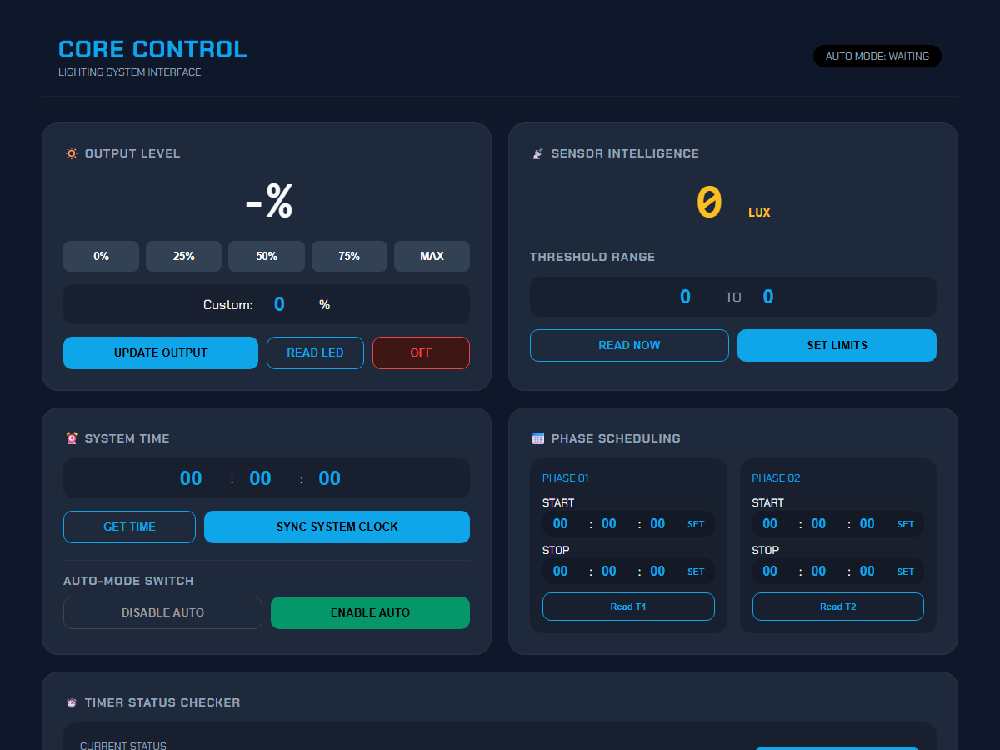

# Project 2: ระบบควบคุมแสงสว่างและตั้งเวลาอัจฉริยะผ่าน Firebase Realtime Database
### Smart Lighting & Environment Automation System with ESP32 & WebApp Dashboard

<div align="center">
  
</div>

<br />

---

## 1. บทนำและภาพรวมระบบ (Overview)

ระบบควบคุมแสงสว่างและสภาพแวดล้อมอัจฉริยะ พัฒนาบนบอร์ดไมโครคอนโทรลเลอร์ **ESP32** ด้วยภาษา **MicroPython** เชื่อมต่อระบบคลาวด์ **Firebase Realtime Database** เพื่อรับคำสั่งและส่งข้อมูลการทำงานแบบสองทาง (Bi-directional Telemetry) ควบคุมผ่านเว็บแดชบอร์ด **Core Control - Lighting System Interface** ที่ออกแบบในสไตล์ Minimal Dark Engineering Dashboard

ระบบรองรับการทำงานทั้งแบบควบคุมด้วยตนเอง (Manual Override), ควบคุมตามตารางเวลา (Phase Scheduling), และระบบอัตโนมัติตามระดับความเข้มแสง (Lux Threshold Auto-Trigger)

---

## 2. คุณสมบัติหลักของระบบ (Key Features)

- **การควบคุมเอาต์พุตความสว่าง (Output Level Dimmer):**
  - ควบคุมการหรี่และเพิ่มความสว่างหลอดไฟ LED ผ่านสัญญาณ PWM ความถี่ 1,000 Hz
  - ปุ่ม Preset ลัด: 0%, 25%, 50%, 75%, และ MAX (100%)
  - กำหนดค่าความสว่างแบบกำหนดเอง (Custom 0–100%) พร้อมคำสั่งปิดไฟทันที (OFF)
- **การตรวจวัดและควบคุมตามระดับแสง (Sensor Intelligence):**
  - ตรวจวัดค่าความเข้มแสงแวดล้อมแบบเรียลไทม์ผ่านเซนเซอร์ **BH1750** (หน่วย LUX)
  - กำหนดช่วงขอบเขตความเข้มแสงอัตโนมัติ (Threshold Range: Min LUX – Max LUX)
- **ระบบเวลาและตารางเวลาสองเฟส (Dual-Phase Scheduling):**
  - ซิงค์เวลาความแม่นยำสูงด้วยโมดูล RTC **DS3231**
  - กำหนดเวลาเปิด-ปิดอิสระ 2 ช่วงเวลา (Phase 01 และ Phase 02)
  - สลับโหมดการทำงานอัตโนมัติ (Auto Mode: Enable / Disable)
- **สถาปัตยกรรมคลาวด์และการแลกเปลี่ยนข้อมูล (Cloud Architecture):**
  - สื่อสารผ่าน **Firebase Realtime Database** แบบเรียลไทม์
  - ใช้กลไก Cache Invalidation (Ping Handshake) บังคับรีเฟรชสถานะฮาร์ดแวร์ก่อนอ่านค่า ป้องกันปัญหาข้อมูลค้างในบัฟเฟอร์
  - ระบบสำรองค่าคอนฟิกูเรชันอัตโนมัติลงในหน่วยความจำ Flash (`backup.json`) เมื่อบอร์ดรีบูต
- **อินพุตและการสื่อสารภายนอก:**
  - รองรับการสั่งงานผ่านปุ่มกด Matrix Keypad 4x4 และแสดงผลหน้างานบนหน้าจอ LCD 16x2 I2C
  - รองรับการสื่อสารไร้สายระยะสั้นผ่าน **Bluetooth Low Energy (BLE UART Service)**

---

## 3. แผนผังการต่อวงจรและพินใช้งาน (Hardware Interfacing)

| อุปกรณ์ (Component) | สัญญาณ / พิน (Signal) | พินบน ESP32 (GPIO) | ฟังก์ชันการทำงาน |
| :--- | :--- | :--- | :--- |
| **BH1750 Sensor** | I2C SDA / SCL | GPIO 21 / GPIO 22 | วัดความเข้มแสง (LUX) |
| **DS3231 RTC** | I2C SDA / SCL | GPIO 21 / GPIO 22 | อ้างอิงสัญญาณนาฬิกาจริง |
| **LCD 16x2 I2C** | I2C SDA / SCL | GPIO 21 / GPIO 22 | แสดงสถานะการทำงานหน้าเครื่อง (Address `0x27`) |
| **LED Load** | PWM Control | GPIO 18 | ขับสัญญาณหรี่แสง PWM (1 kHz) |
| **Matrix Keypad 4x4** | Rows (R1–R4) | GPIO 4, 5, 12, 13 | ส่งสัญญาณสแกนแถวปุ่มกด |
| **Matrix Keypad 4x4** | Columns (C1–C4) | GPIO 14, 15, 32, 33 | อ่านค่าคอลัมน์ (Internal Pull-down) |

---

## 4. โครงสร้างไฟล์โปรเจกต์ (File Structure)

```text
projects/02-iot-smart-lighting-firebase/
├── firmware/
│   └── main.py              # ซอร์สโค้ด MicroPython (Wi-Fi, Firebase, BLE, Keypad, PWM, Sensors)
├── webapp/
│   ├── index.html           # Core Control WebApp Dashboard (Dark Theme Interface)
│   ├── 404.html             # Firebase Hosting Error Page
│   ├── firebase.json        # คอนฟิกูเรชัน Firebase Hosting
│   └── database.rules.json  # กฎความปลอดภัยของ Firebase Realtime Database
└── README.md
```
